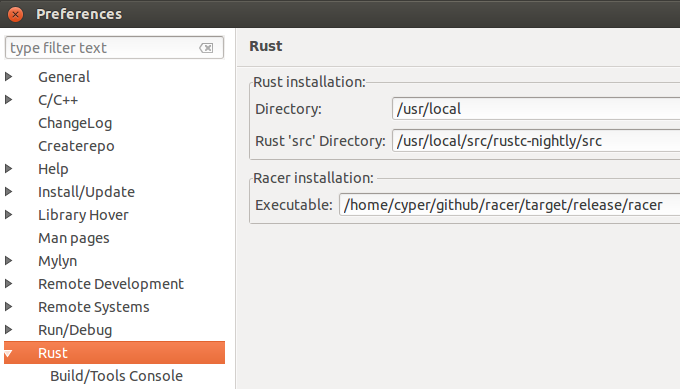
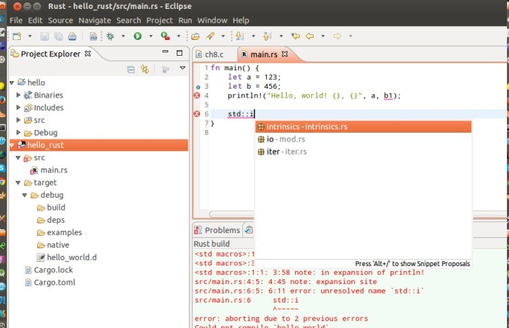

## Eclipse CDT下安装Rust插件

    作者:Cyper，　转载请注明出处.
    
本文只针对有经验的Eclipse用户
####1. 安装Rust nightly  （略）
安装完成后使用命令`which rustc`，可以看到安装路径为`/usr/local/bin/rustc`, 此处的安装位置`/usr/local`后面需要引用.

####2. 安装Eclipse CDT（略）
下载最新的CDT解压

####3. 安装RustDT
参考这里：http://rustdt.github.io/, 在Help > install new software中输入update site: https://rustdt.github.io/releases/, 这一步很慢多等一下．１０分钟是需要的，作者特别提到Users in China也可以下载离线升级包https://github.com/RustDT/rustdt.github.io/archive/master.zip
####4.下载Rust源码
官网首页就有, `rustc-nightly-src.tar.gz`, 20多M，我将其解压到/usr/local/src目下.并设置环境变量
`export RUST_SRC_PATH=/usr/local/src/rustc-nightly/src`

####5.安装racer(Rust auto complete - er)

    git clone https://github.com/phildawes/racer.git
    cd racer; cargo build --release

这步编译需要等几分钟，　结束后在target目录下会成生成racer命令.

####6. 配置RustDT
直接看图，第一个是rust的安装目录，第二个是rust源码目录，第三个是racer的位置.



####7. 自定义快捷键
还比较原始，打开jar包中的templates文件，暴力修改:
`/home/cyper/.eclipse/org.eclipse.platform_4.4.2_1504408775_linux_gtk_x86_64/plugins/com.github.rustdt.ide.ui_0.2.0.v201504232210.jar/templates/default-templates.xml`

这个jar包一般在你的Eclipse安装目录的plugins目录下

修改default-templates.xml如下：
```xml
<?xml version="1.0" encoding="UTF-8" standalone="no"?>
<templates>
<template autoinsert="true" context="com.github.rustdt.ide.ui.TemplateContextType" deleted="false" id="BUG" description="BUG here comment" enabled="true" name="BUG">/* FIXME: BUG here${cursor}*/</template>
<template autoinsert="true" context="com.github.rustdt.ide.ui.TemplateContextType" deleted="false" id="FIXME" description="FIXME comment" enabled="true" name="FIXME">/* FIXME: ${cursor}*/</template>
<template autoinsert="true" context="com.github.rustdt.ide.ui.TemplateContextType" deleted="false" id="header_comment" description="header comment" enabled="true" name="headerbar">/* ----------------- ${header} ----------------- */</template>
<template autoinsert="true" context="com.github.rustdt.ide.ui.TemplateContextType" deleted="false" id="forin" description="iterate over an iterable" enabled="true" name="forin">for ${iterable_element} in ${iterable} {&#13;
	${cursor}&#13;
}</template>
<template autoinsert="true" context="com.github.rustdt.ide.ui.TemplateContextType" deleted="false" id="pr" description="println" enabled="true" name="pr">println!("${var}");</template>
<template autoinsert="true" context="com.github.rustdt.ide.ui.TemplateContextType" deleted="false" id="pl" description="println variable" enabled="true" name="pl">println!("{}", ${var});</template>
<template autoinsert="true" context="com.github.rustdt.ide.ui.TemplateContextType" deleted="false" id="pld" description="println debug variable" enabled="true" name="pld">println!("{:?}", ${var});</template>
</templates>
```
参考了这个[pull request]，　然后我自己定义了一个名叫pr的模板 **只要输入pr就能生成println!("");并且光标停在双引号中间;**保存，重启Eclipse.

来个图.



[pull request]: https://github.com/waynenilsen/RustDT/commit/16427af0c6f4569e9b5e0b154ad262832a080b52


